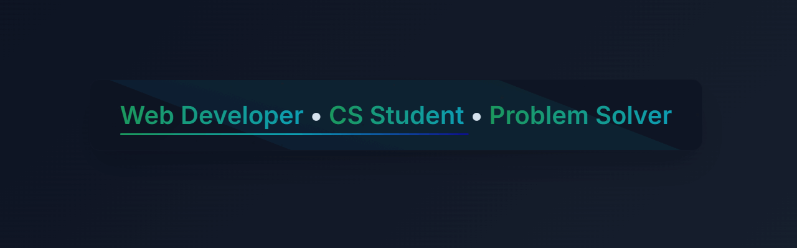

👋 Welcome to my GitHub profile!

 

👨‍💻 About Me 
 
🎓 Computer Science student (Level 300) 
🌐 Web developer — HTML, CSS, JavaScript 
📱 Building real-world projects (like mobile apps) 
⚙️ Learning cloud concepts through self-driven projects 
🚀 Eager to grow and contribute to meaningful tech work 
 

# 💻 Tech Stack:
                 
# 📊 GitHub Stats:
 
 

## 🏆 GitHub Trophies

### ✍️ Random Dev Quote

---

<!-- Proudly created with GPRM ( https://gprm.itsvg.in ) -->

<!-- Proudly created with GPRM ( https://gprm.itsvg.in ) -->
